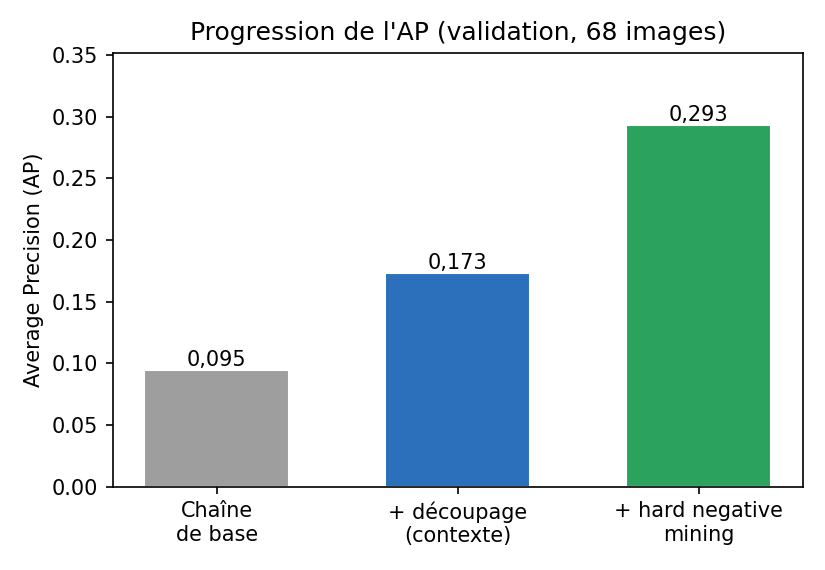
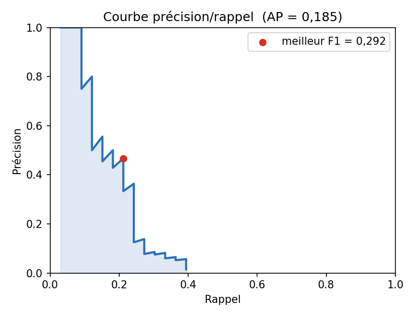
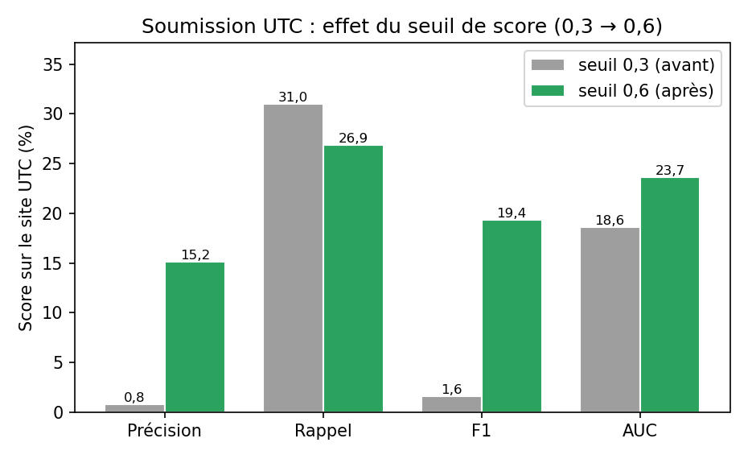
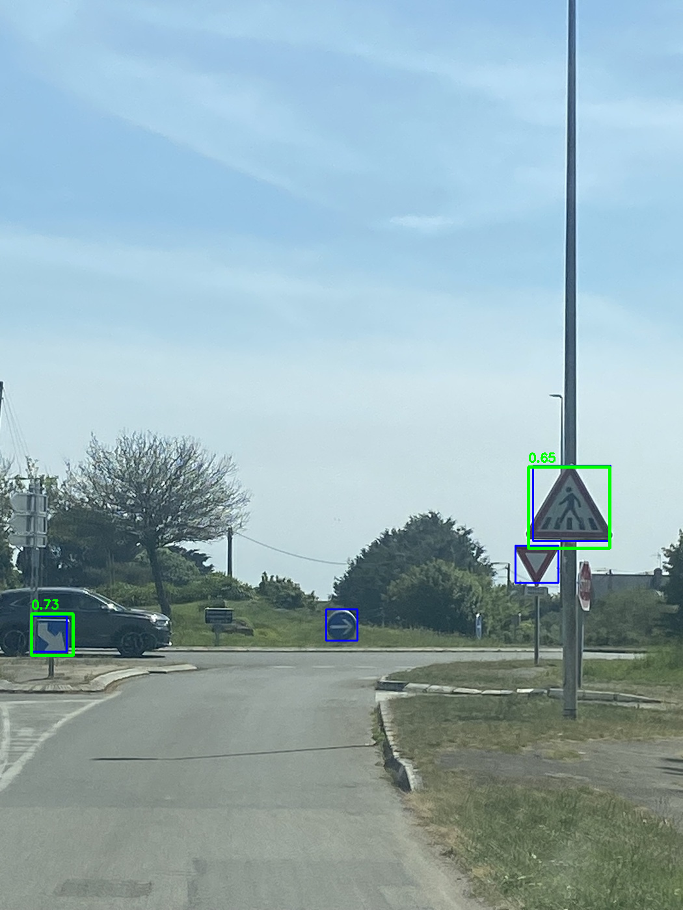
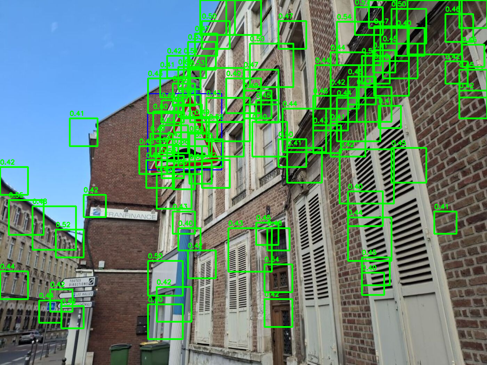
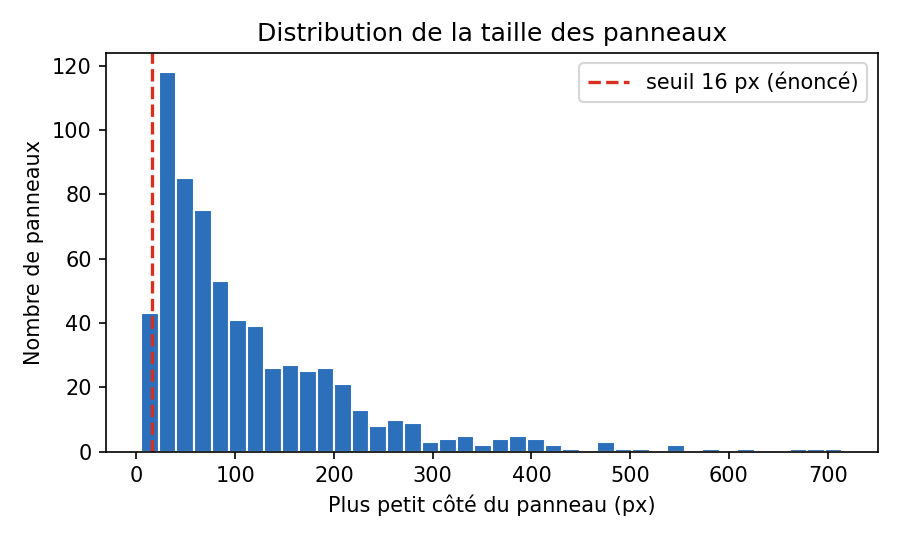
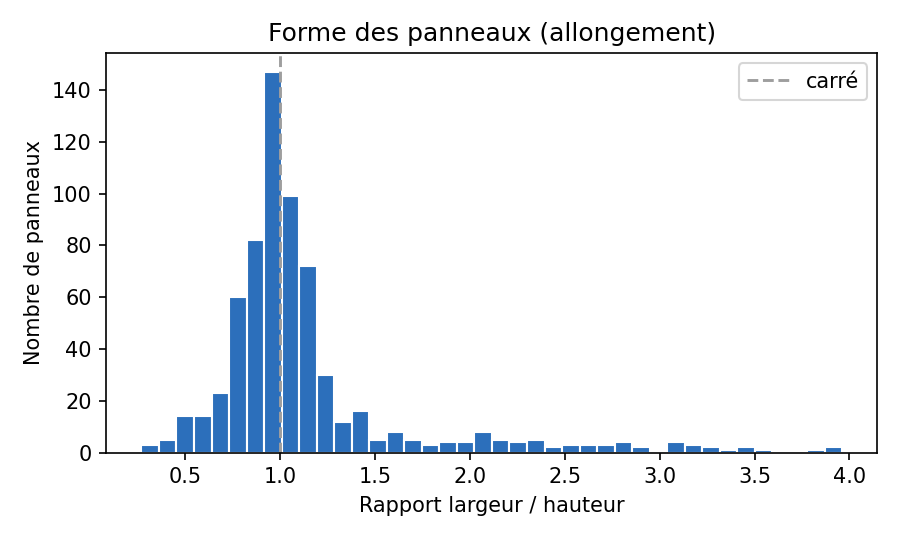
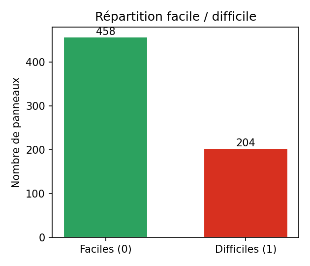

# Détection de panneaux de signalisation routière

**Pipeline de détection d'objets construit sans apprentissage profond** : descripteurs
HOG + couleur + texture, classifieur Random Forest, fenêtre glissante multi-échelle,
hard negative mining et suppression des non-maxima.

<p>
  
  
  
  
  
</p>

> **In brief (EN).** A road-sign detector built *without* deep learning, as required by
> the course. It combines HOG + HSV colour + LBP texture descriptors (1858-D) with a
> Random Forest, scanned over a Gaussian pyramid by a multi-scale sliding window, refined
> by hard negative mining, a colour pre-filter and non-maximum suppression. The guiding
> idea of the whole project: *you can only improve what you can measure* — so the first
> deliverable was an honest evaluation harness (IoU, precision/recall, AP, F1 and a
> leak-free validation split), and every subsequent idea was kept only if the numbers
> confirmed it. Validation AP went from **0.095 to 0.293**; on the hidden test server, a
> single well-diagnosed threshold change lifted precision **×18** and AUC from
> **18.6 % to 23.7 %**.

---

## Sommaire

- [Contexte](#contexte)
- [Résultats](#résultats)
- [Le pipeline](#le-pipeline)
- [Ce que le projet démontre](#ce-que-le-projet-démontre)
- [Structure du dépôt](#structure-du-dépôt)
- [Installation et utilisation](#installation-et-utilisation)
- [Jeu de données](#jeu-de-données)
- [Documentation](#documentation)
- [Limites et pistes](#limites-et-pistes)
- [Licence et contexte](#licence-et-contexte)

---

## Contexte

Projet réalisé **en binôme** dans le cadre de l'UE **SY32 (Vision et apprentissage
artificiels)** à l'Université de technologie de Compiègne, semestre P2026.

L'objectif : à partir d'une photo de rue, produire une ou plusieurs **boîtes
englobantes** de panneaux de signalisation, chacune assortie d'un **score de
confiance**. La contrainte structurante est que **l'apprentissage profond est
interdit** — uniquement des méthodes classiques de vision et d'apprentissage
(`scikit-learn`, `scikit-image`, OpenCV). Une partie du jeu de test comporte en outre
des images à **distorsion fisheye**, non représentées dans l'entraînement.

Les rendus sont évalués sur un **serveur d'évaluation UTC** avec un jeu de test
dont les annotations ne sont jamais révélées.

## Résultats

### Progression sur notre jeu de validation

68 images / 147 panneaux, IoU ≥ 0,5, `stride = 16`, seuil de score 0,3.

| Étape | AP (AUC) | F1 | Détections |
|---|---:|---:|---:|
| Baseline (première version) | 0,095 | 0,224 | 8 511 |
| + correction du découpage des positifs | 0,173 | 0,272 | 19 341 |
| **+ hard negative mining multi-échelle** | **0,293** | **0,387** | 11 039 |

Le hard negative mining apporte un double gain : **+69 % d'AP** *et* **−43 % de
détections**, c'est-à-dire beaucoup moins de faux positifs.

<p align="center">
  
  
</p>

### Soumissions sur le serveur d'évaluation UTC

| Soumission | Seuil de score | Précision | Rappel | F1 | AUC |
|---|---:|---:|---:|---:|---:|
| #1 | 0,3 | 0,82 % | 30,97 % | 1,59 % | 18,59 % |
| **#2** | **0,6** | **15,16 %** | 26,87 % | **19,38 %** | **23,68 %** |

La première soumission a révélé un défaut majeur : un rappel correct mais une
précision d'à peine 0,82 %, soit ~99 fausses boîtes sur 100. Le diagnostic — un seuil
de score volontairement bas (utile pour tracer la courbe AP, désastreux en
soumission) — a été confirmé par la seconde soumission : **précision ×18, F1 ×12,
AUC +5 points**, sans réentraînement, par simple réglage du point de fonctionnement.

<p align="center">
  
</p>

### Analyse qualitative

| Cas de réussite | Cas d'échec |
|---|---|
|  |  |
| Panneau correctement localisé avec un score élevé. | Une façade en brique est massivement sur-détectée — illustration concrète du problème de précision. |

## Le pipeline

```
images + annotations
        │
        ▼
 préparation des exemples        data_load.py  : chargement, découpage des panneaux
        │                        training.py   : échantillonnage des négatifs
        ▼
 descripteurs                    features.py   : HOG (9 orient., cellules 8×8)
 HOG + HSV + LBP → 1858-D                     + histogramme HSV (36+32+16)
        │                                      + LBP uniform (P=8, R=1)
        ▼
 entraînement Random Forest      training.py   : 100 arbres
        │
        ▼
 hard negative mining            training.py   : ré-injection des faux positifs
        │                                        les plus « durs », multi-échelle
        ▼
 détection multi-échelle         detector/sliding_window.py
 (pyramide gaussienne ×1,25)     + pré-filtre couleur HSV
        │
        ▼
 suppression des non-maxima      detector/nms.py  : IoU 0,3
        │
        ▼
 boîtes + scores                 predict_test.py  : CSV de soumission
```

### Paramètres principaux

| Paramètre | Valeur |
|---|---|
| Taille des imagettes | 64 × 64 px |
| Pas de la fenêtre glissante | 16 px |
| Réduction entre niveaux de pyramide | × 1,25 |
| Seuil de score (évaluation / soumission) | 0,3 / 0,6 |
| Seuil d'IoU — NMS / association vérité | 0,3 / 0,5 |
| Random Forest | 100 arbres |
| Dimension du descripteur | 1858 |

## Ce que le projet démontre

- **Mesurer avant d'optimiser.** Le pipeline initial affichait 98,96 % d'*accuracy*
  sur imagettes… pour une AP de 0,095 en détection réelle. Construire les bonnes
  métriques (IoU, précision/rappel, AP, F1) et un **jeu de validation sans fuite de
  données** (découpage *par image*, jamais par imagette) a été le vrai point de départ.
- **Diagnostiquer plutôt que réentraîner.** Le gain le plus spectaculaire (AUC
  18,6 → 23,7 %) n'a coûté aucun réentraînement : il venait de l'analyse d'un écart
  précision/rappel anormal.
- **Reproductibilité.** Deux exécutions du même code donnaient des AP différentes
  (0,284 puis 0,232) : le module `random` de Python n'était pas figé, seul NumPy
  l'était. Corrigé dans [`src/config.py`](src/config.py).
- **Discipline expérimentale.** Chaque idée (augmentation fisheye, LBP, pré-filtre
  couleur, SVM vs Random Forest) a été mesurée puis **conservée ou écartée sur les
  chiffres** — y compris les essais non concluants, documentés tels quels dans le
  [journal de bord](docs/journal-de-bord.md).

## Structure du dépôt

```
src/
  config.py                  paramètres globaux, graines aléatoires figées
  data_load.py               chargement images/annotations, découpage des panneaux
  features.py                descripteurs HOG + HSV + LBP, distorsion fisheye
  training.py                négatifs, hard negative mining, entraînement
  detector/
    sliding_window.py        détection multi-échelle (fenêtre glissante + pyramide)
    nms.py                   IoU et suppression des non-maxima
  metrics.py                 IoU, précision/rappel, AP (AUC), F1
  evaluation.py              entraîne sur train/, évalue sur val/
  predict_test.py            détection sur test/ → CSV de soumission
  figures.py                 génération des figures du rapport
  visualiser.py              visualisation vérité terrain + détections
docs/
  rapport.pdf                rapport complet (9 pages)
  rapport.tex                source LaTeX du rapport
  architecture.md            documentation technique, fonction par fonction
  journal-de-bord.md         journal expérimental : mesures, échecs, décisions
  hard-negative-mining.md    note dédiée au hard negative mining
figures/                     figures d'analyse et exemples qualitatifs
results/
  predictions_test.csv       exemple de sortie au format de soumission
```

## Installation et utilisation

```bash
pip install -r requirements.txt
```

Toutes les commandes se lancent **depuis le dossier `src/`** et supposent le jeu de
données présent dans `data/` (voir [Jeu de données](#jeu-de-données)).

```bash
cd src

# Évaluer le modèle sur la validation (AP, précision, rappel, F1)
python evaluation.py          # toutes les images de validation
python evaluation.py 25       # 25 images seulement (itération rapide)

# Produire les prédictions de test
python predict_test.py retrain   # entraîne, sauvegarde le modèle, puis prédit
python predict_test.py           # recharge le modèle sauvegardé, puis prédit
python predict_test.py show      # idem + affichage des détections

# Regénérer les figures du rapport
python figures.py             # statistiques du jeu de données et graphes
python figures.py pr          # courbe précision/rappel (lance une vraie évaluation)
```

Le CSV produit suit le format imposé : `Num img, Coin h-g y, Coin h-g x, Hauteur,
Largeur, Score`, une ligne par détection. Un exemple est fourni dans
[`results/predictions_test.csv`](results/predictions_test.csv).

### Compiler le rapport

```bash
cd docs && pdflatex -interaction=nonstopmode rapport.tex
```

## Jeu de données

Le jeu de données (341 images, 662 boîtes annotées) est **fourni par l'UTC et n'est
pas redistribué ici** : il n'est pas à nous, et il pèse ~300 Mo. Le dossier `data/`
est donc volontairement absent du dépôt. L'arborescence attendue par le code est :

```
data/
  train/images/pos/   train/images/neg/   train/labels/
  val/images/pos/     val/labels/
  test/
```

Les annotations sont des CSV `ymin, xmin, hauteur, largeur, difficulté` par image.
Statistiques mesurées sur le jeu : 458 panneaux faciles / 204 difficiles, petit côté
médian de 79 px, ratio largeur/hauteur médian de 1,00 (panneaux quasi carrés).

<p align="center">
  
  
  
</p>

## Documentation

| Document | Contenu |
|---|---|
| [`docs/rapport.pdf`](docs/rapport.pdf) | Rapport complet : méthode, protocole d'évaluation, résultats, analyse d'erreurs |
| [`docs/architecture.md`](docs/architecture.md) | Fonctionnement du code, enchaînement des étapes et rôle de chaque fonction |
| [`docs/journal-de-bord.md`](docs/journal-de-bord.md) | Journal expérimental brut : mesures datées, régressions, décisions et impasses |
| [`docs/hard-negative-mining.md`](docs/hard-negative-mining.md) | Note technique sur l'implémentation du hard negative mining |

## Limites et pistes

Le détecteur reste modeste dans l'absolu, et les limites sont assumées :

- **Précision encore faible** : les structures répétitives (façades, stores, fenêtres)
  restent la principale source de faux positifs.
- **Coût de la fenêtre glissante** : ~13 s par image avec `stride = 16`, l'essentiel du
  temps étant passé à calculer le HOG sur des milliers de fenêtres.
- **NMS en O(n²)**, pénalisante quand le modèle produit beaucoup de boîtes.
- **Panneaux triangulaires** mal reconnus, et **fisheye** peu robuste : l'augmentation
  par distorsion testée dégradait l'AP (0,284 → 0,221) et a été écartée.

Pistes identifiées : calibration des scores, plafonnement du nombre de détections par
image, propositions de régions par couleur plutôt que balayage exhaustif, et
exploitation de la colonne « difficulté » à la manière de PASCAL VOC.

## Licence et contexte

Projet académique réalisé en binôme dans le cadre de l'UE SY32 à l'UTC (P2026).
Le code est publié ici à des fins de démonstration et de portfolio ; il n'est pas
distribué sous licence libre. Le jeu de données appartient à l'UTC et n'est pas inclus.

Conformément à l'énoncé, l'usage d'un assistant d'IA générative est déclaré dans le
[rapport](docs/rapport.pdf) : aide à la mise en place des métriques, au débogage, à la
génération des figures et à la rédaction. Toutes les décisions, mesures et validations
ont été contrôlées par les auteurs.
